# Hola Mundo en Pseudocódigo

Empecemos por el primer proyecto en cualquier lenguaje: "Hola Mundo", es decir la función básica **escribir en pantalla**

Para desarrollar un programa ue muestre textos en pantalla en la mayor parte de versiones se utilizará el comando **ESCRIBIR** (en otras versiones puede ser **IMPRIMIR** o **MOSTRAR**).

Después de esta palabra especificarás, entre comillas, el texto que deseas que aparezca en pantalla.

Debe verse algo más o menos así:

~~~pseudocode
Escribir "Hola Mundo";
~~~

Hacerlo usando PSeint es igual de sencillo.

Solamente tiene la variación de que cada programa debe encerrarse con las palabras *"Algoritmo"* (para indicar donde comienza tu programa) y *"FinAlgoritmo"* (para señalar donde termina el código)

Debe quedarte algo así:

 ~~~pseudocode
Algoritmo Hola
    Escribir "Hola Mundo";
FinAlgoritmo
~~~

Aquí esta la teoría, ahora vamos a la práctica.

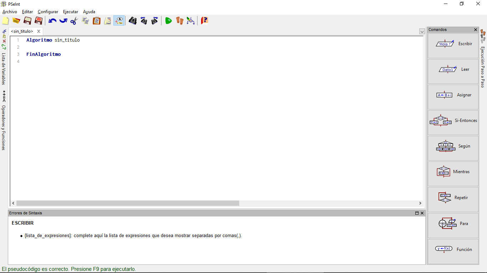

Paso 1: En la línea que esta entre *"Algoritmo"* y *FinAlgoritmo* es donde comenzarás a redactar tu programa, en este caso teclearas la palabra "Escribir", puedes ponerla completa o cuando te aparezca la palabra en la parte de abajo, dar Enter.

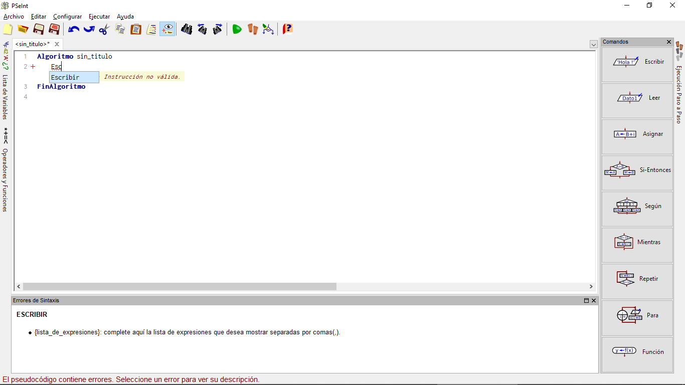

Mientras mantengas unicamente la indicación, PSeint te pondrá la definición y los parámetros de esa función.

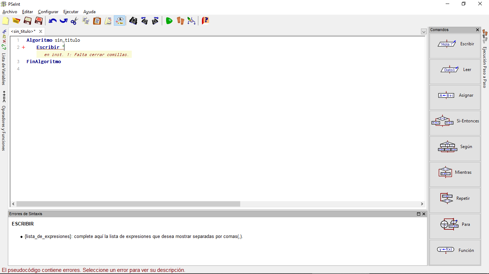

Paso 2: Asigna un parámetro o valor a tu código, en este caso, un Hola Mundo, recuerda que al tratarse de un valor ajeno al lenguaje debes de utilizar comillas para que el lenguaje lo comprenda

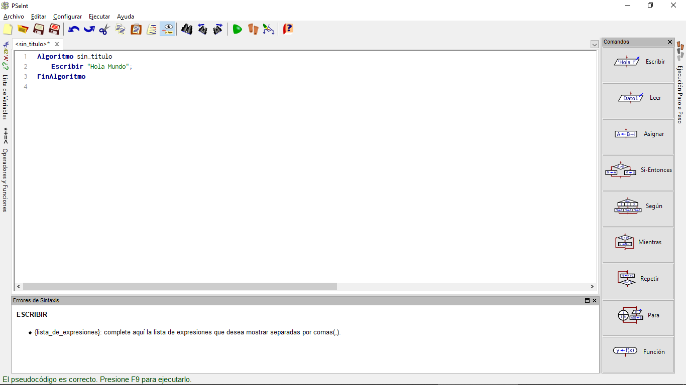

Mientras escribes el mensaje a imprimir en pantalla, PSeint te estará diciendo que falta cerrar comillas.

Paso 3: Asignale un nombre a tu pseudocódigo
Es muy simple de hacer, solamente escribe el nombre de tu programa en donde dice *sin_titulo*, delante de "Algoritmo"

Una vez escrito esto, tienes completo tu primer "Hola Mundo" en Pseudocódigo, solamente falta probarlo.

Paso 4: Ejecuta el pseudocódigo que hiciste.
Hacer esto es muy simple, solamente presiona el triángulo color verde que aparece en tu barra de herramientas en la parte superior.

Al ejecutar tu pseudocódigo se abrirá una ventana emergente la cual ejecutará lo que escribiste.

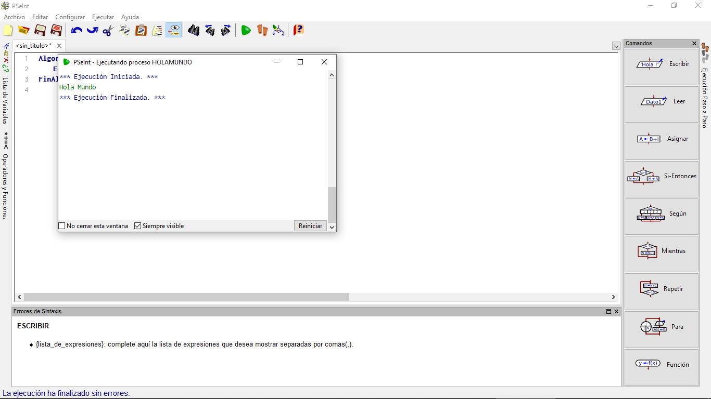

Un programa puede estar formado por más de una orden. Basta con pulsar Enter para añadir una nueva línea en blanco. También puedes utilizar los comandos del panel de tu lado derecho.

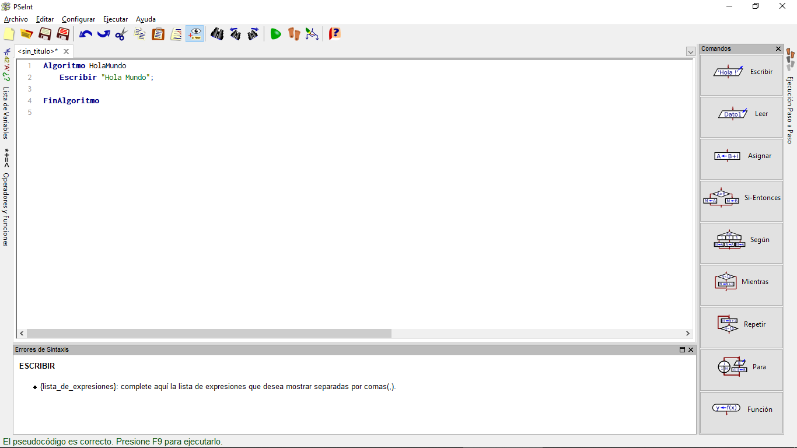

## Ahora ampliamos nuestro "Hola Mundo"

Añadiremos el siguiente texto al código:

~~~pseudocode
Escribir "Estoy programando";
~~~

Dejando nuestro código anterior así:

 ~~~pseudocode
Algoritmo Hola
    Escribir "Hola Mundo";
    Escribir "Estoy programando";
FinAlgoritmo
~~~

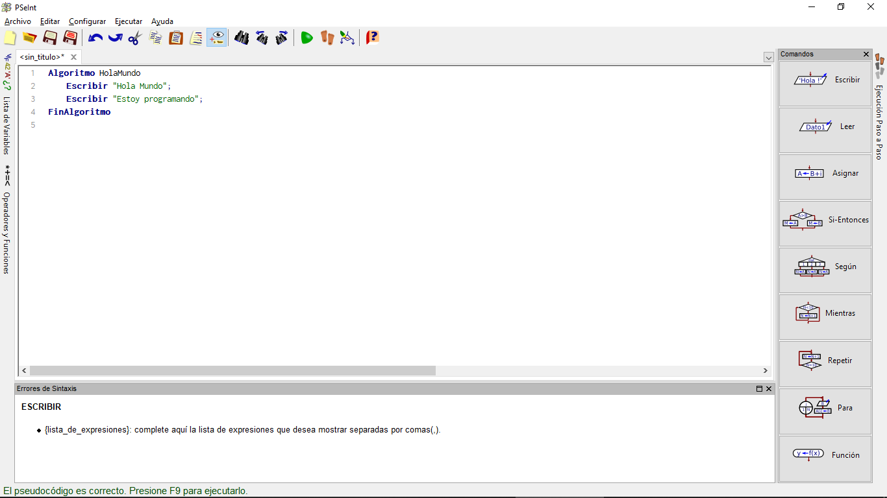

El nuevo resultado del programa sería:

~~~text
Hola Mundo
Estoy programando
~~~

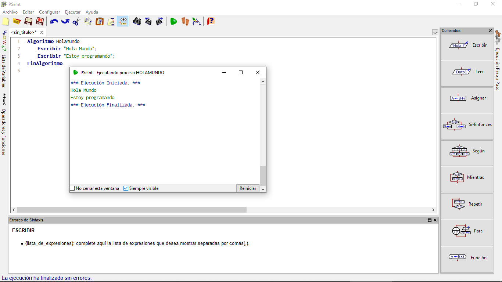

### Desactivar "ayudas" de PSeint

A veces es fastidiosa la predicción y demás herramientas que se supone facilitan el desarrollo, sin embargo puedes deshabilitarlos al gusto.

Solo debes de ir a "Configurar>Asistencias" en ese menú solo deshabilita las funciones que sientas que no te sirven.

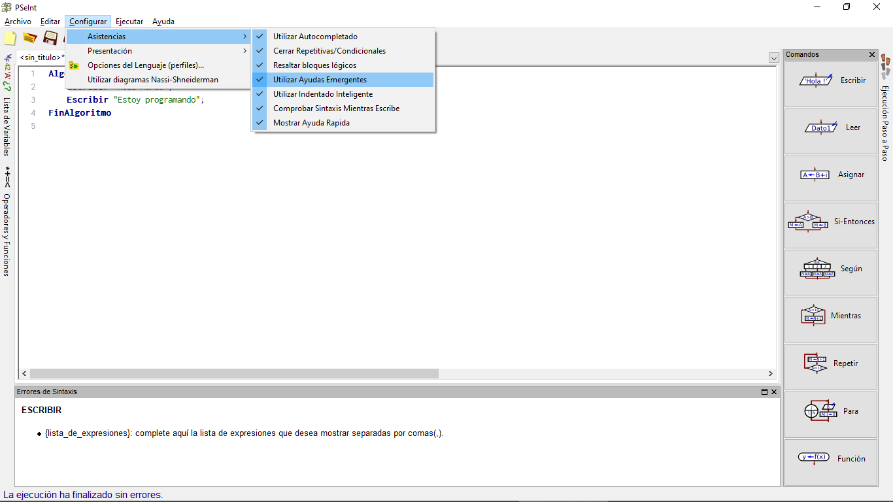

## Operaciones con pseudocódigo

No puedes usar el pseudocódigo solo para mensajes fijos, igual puedes utilizarlo para realizar operaciones matemáticas.

Al igual que en la vida cotidiana se usan los operadores así:

\+ Suma
\- Resta
\* Multiplicación
/ División
^ Potencia

Añadiendo un operador más:

% Residuo, como su nombre lo indica, se encargará de devolver el restante de una división.

Comencemos a experimentar con las operaciones, ingresa el siguiente código:

~~~pseudocode
Algoritmo Suma
    Escribir 20+30;
FinAlgoritmo
~~~

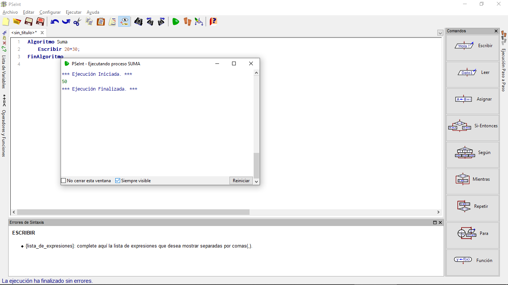

Ahora probemos el operador de residuo:

~~~pseudocode
Algoritmo Residuo
    Escribir 15%2;
FinAlgoritmo
~~~

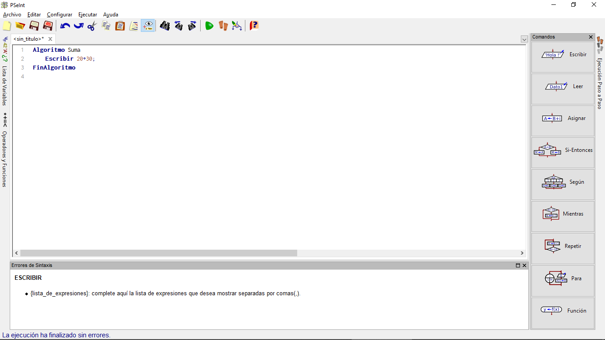

## Escribir varios textos en una misma línea

Puedes escribir varios textos en una línea sin necesidad de hacer un "brinco".

Para esto solamente ocuparas el operador **ESCRIBIR SIN SALTAR**.

Algo así:

~~~pseudocode
Algoritmo EscribirSinSaltar
    Escribir Sin Saltar "9876 * 54321 = "
    Escribir 9876*54321
FinAlgoritmo
~~~

~~~text
    
    // También puedes agregar comentarios, notas o aclaraciones que te ayuden a expresar la lógica de tu programa haciendo uso de dos paréntesis seguidos (//)
~~~

Eso es todo por esta lección, te recomiendo hacer los ejercicios para que comprendas los conceptos base del pseudocódigo.
