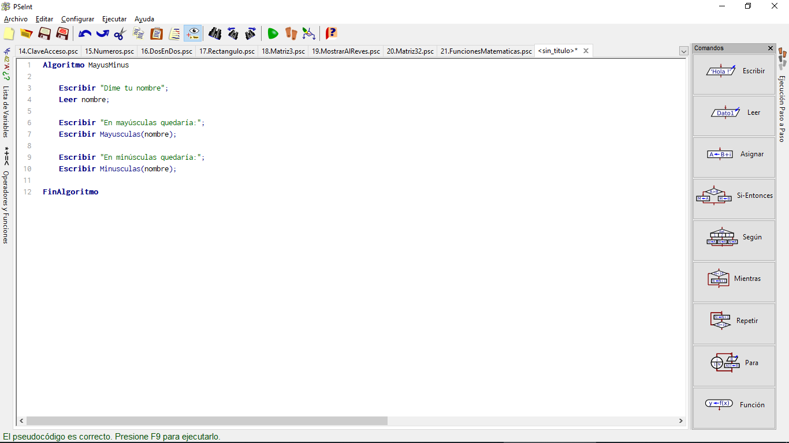
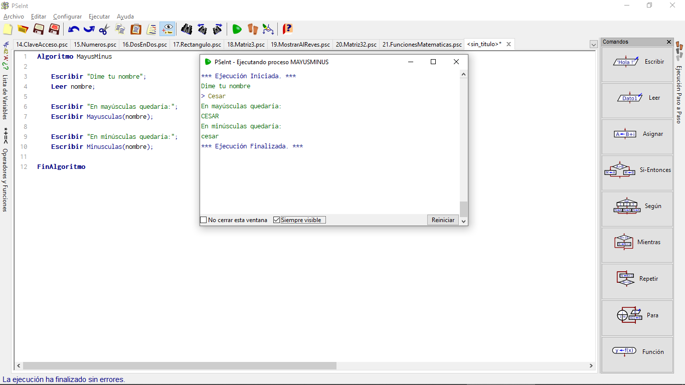
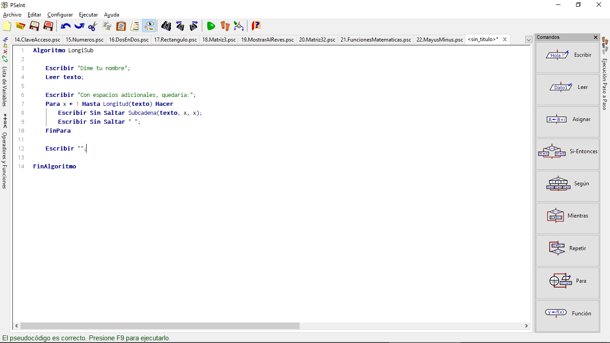
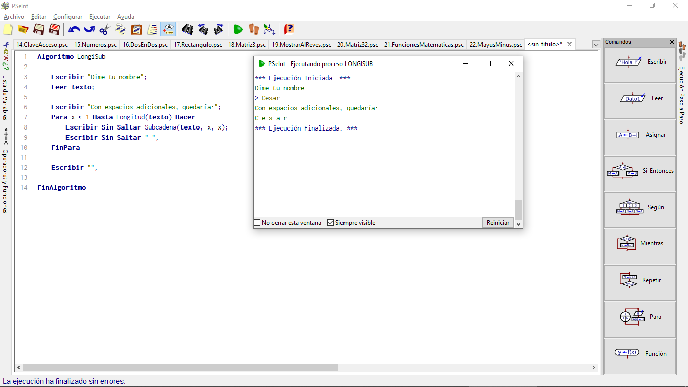
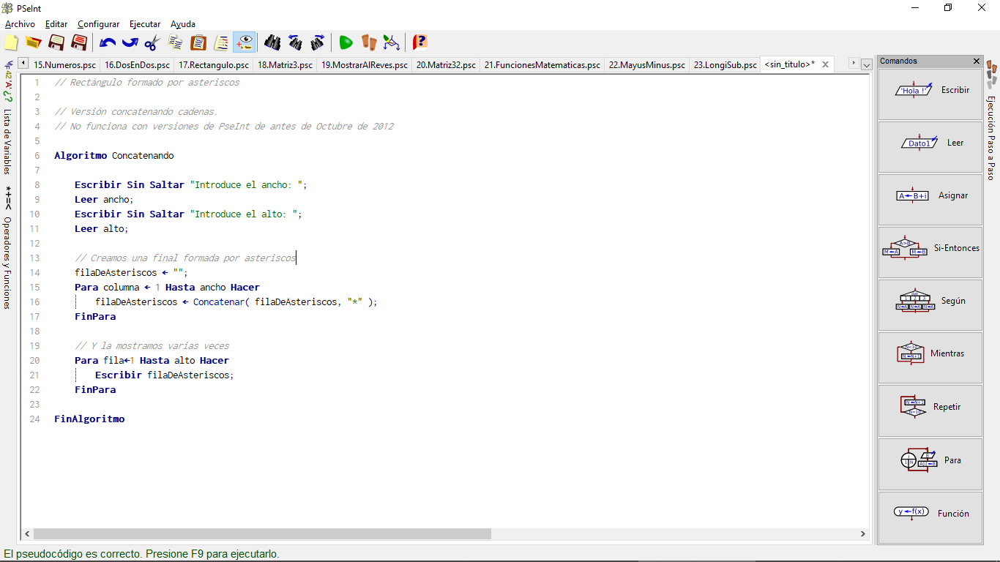
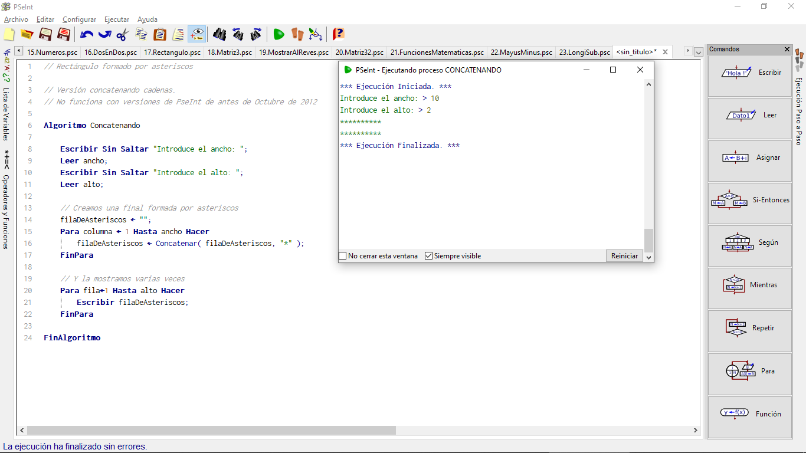

# Manejo de Cadenas de Texto

Desde octubre de 2012, PseInt incluye ciertas funciones de manejo de cadenas de texto que es habitual encontrar en casi cualquier lenguaje de programación.

## Mayúsculas y Minúsculas

Las dos más sencillas son las que permiten convertir un texto a mayúsculas y a minúsculas:

~~~pseudocode
Algoritmo MayusMinus
    
    Escribir "Dime tu nombre";
    Leer nombre;

    Escribir "En mayúsculas quedaría:";
    Escribir Mayusculas(nombre);

    Escribir "En minúsculas quedaría:";
    Escribir Minusculas(nombre);

FinAlgoritmo
~~~

En PSeint tu programa debe verse algo así:

Ahora al correrlo debes de obtener lo siguiente:

## Longitud y Subcadena

Hay otras dos funciones que dan mucho más juego: una nos dicen la longitud de una cadena y otra permite extraer una subcadena, desde cierta posición inicial hasta cierta posición final:

~~~pseudocode
Algoritmo LongiSub

    Escribir "Dime tu nombre";
    Leer texto;

    Escribir "Con espacios adicionales, quedaría:";
    Para x <- 1 Hasta Longitud(texto) Hacer
        Escribir Sin Saltar Subcadena(texto, x, x);
        Escribir Sin Saltar " ";
    FinPara

    Escribir "";

FinAlgoritmo
~~~

Escribe tu código en PSeint:

Ahora corre el código y observa lo que pasa:

(Si usamos la configuración normal de PseInt, las posiciones dentro de la cadena se empezarán a contar desde uno; ya sabemos, como vimos en "Matrices", que en muchos otros lenguajes de programación se empieza a contar desde cero; PseInt también se puede configurar para trabajar así).

## Concatenar Cadenas

También es posible "concatenar" dos cadenas, es decir, formar una nueva cadena a partir de la unión de esas dos. Por ejemplo, el resultado de Concatenar("1a", "2b") sería la cadena de texto "1a2b". Así, el ejemplo del rectángulo de asteriscos se podría hacer, de forma alternativa, creando primero una cadena que fuera la fila de asteriscos y luego mostrándola varias veces, así:

~~~pseudocode
// Rectángulo formado por asteriscos

// Versión concatenando cadenas.
// No funciona con versiones de PseInt de antes de Octubre de 2012

Algoritmo Concatenando

    Escribir Sin Saltar "Introduce el ancho: ";
    Leer ancho;
    Escribir Sin Saltar "Introduce el alto: ";
    Leer alto;

    // Creamos una final formada por asteriscos
    filaDeAsteriscos <- "";
    Para columna <- 1 Hasta ancho Hacer
        filaDeAsteriscos <- Concatenar( filaDeAsteriscos, "*" );
    FinPara

    // Y la mostramos varias veces
    Para fila<-1 Hasta alto Hacer
        Escribir filaDeAsteriscos;
    FinPara

FinAlgoritmo 
~~~

Ahora lo ponemos en PSeint:

Una vez hecho esto, corremos el código:

