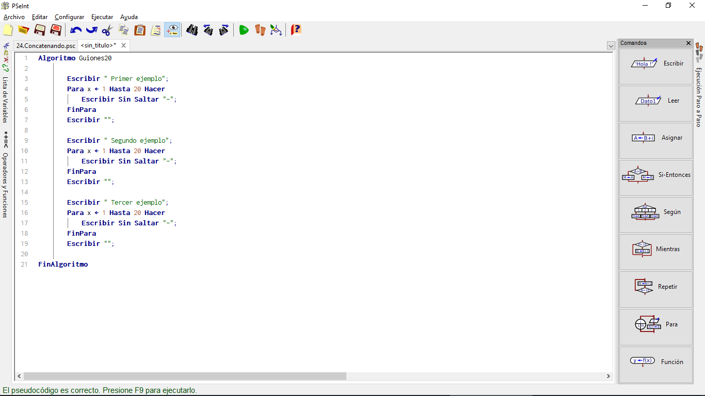
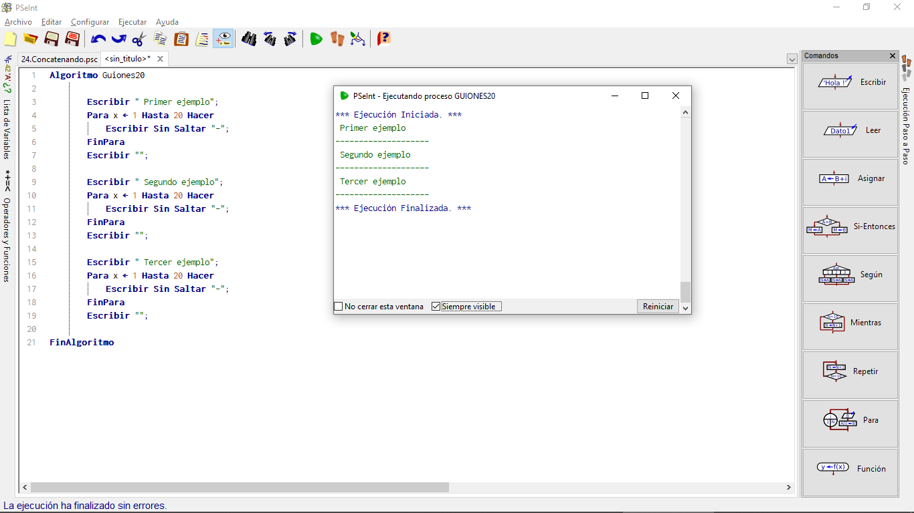
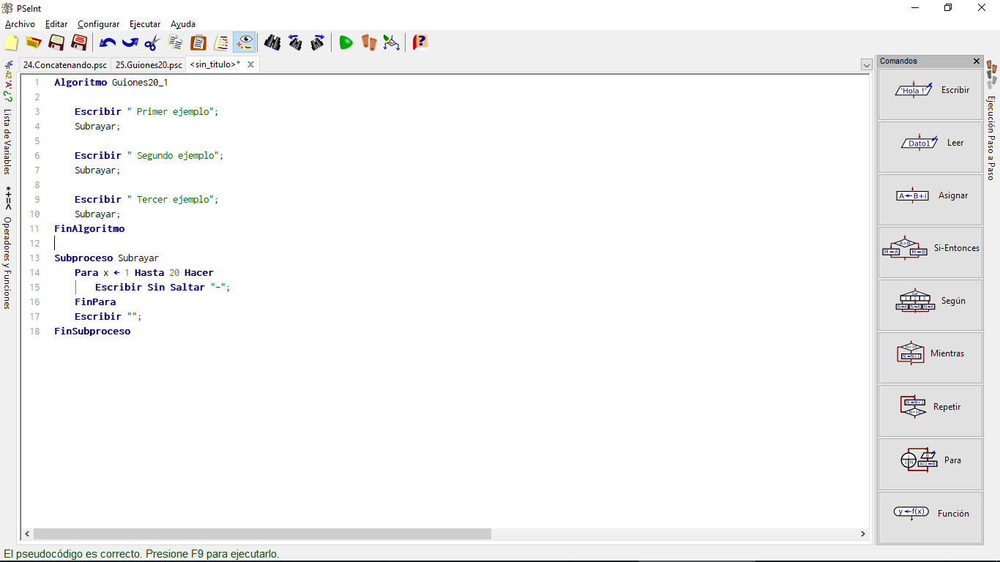
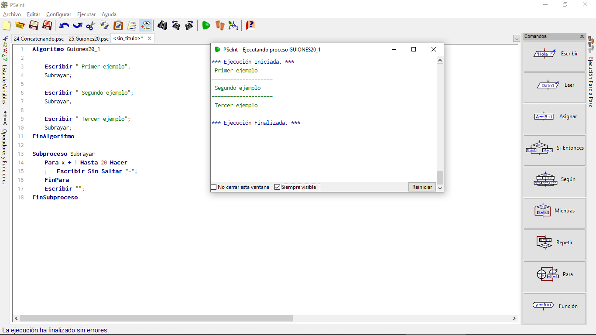
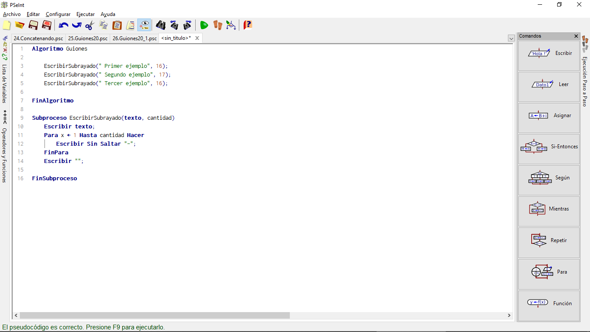
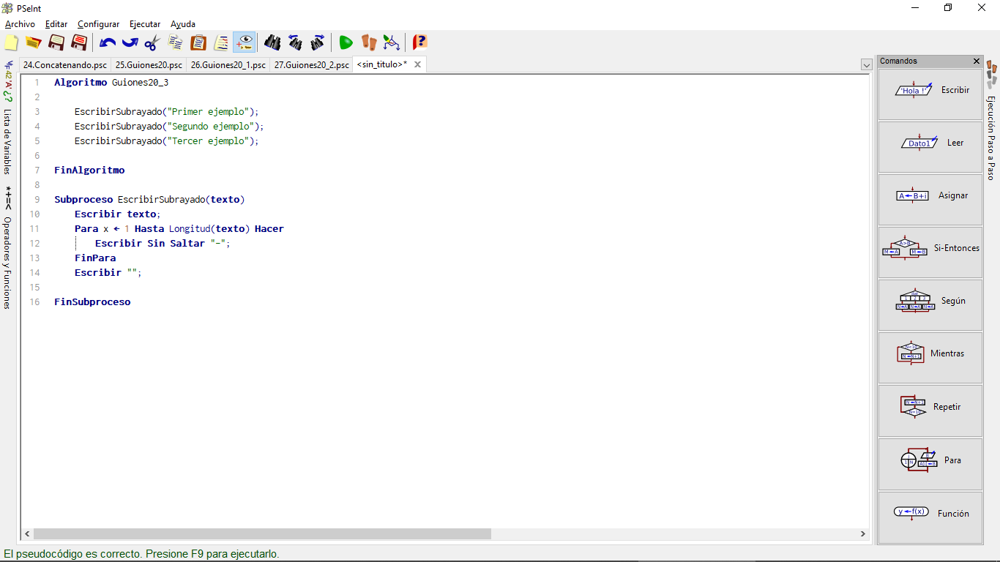
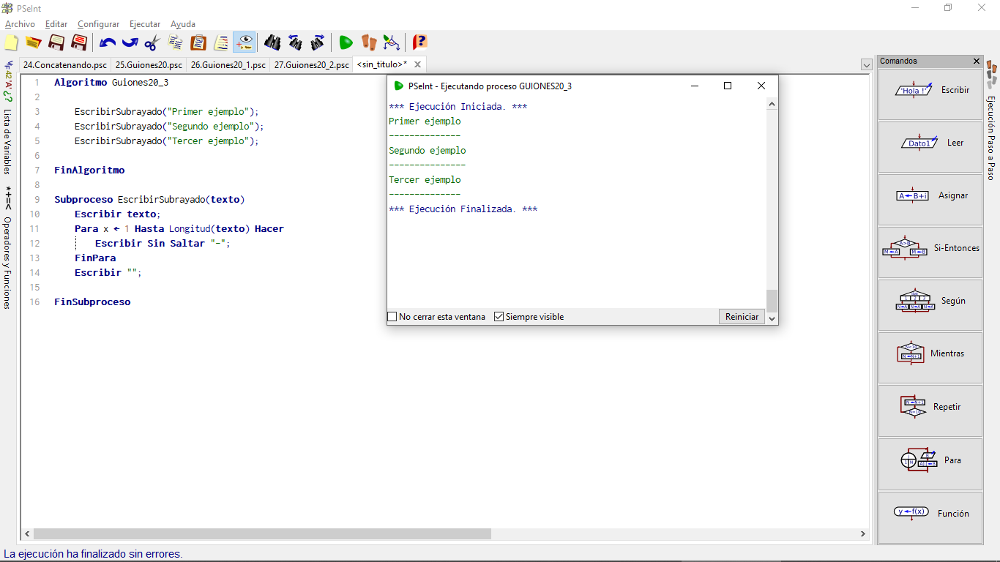
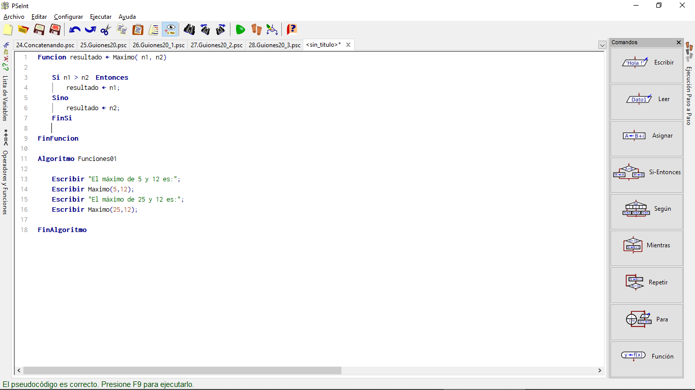
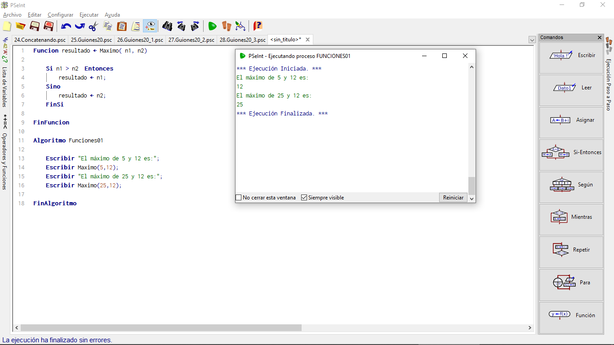
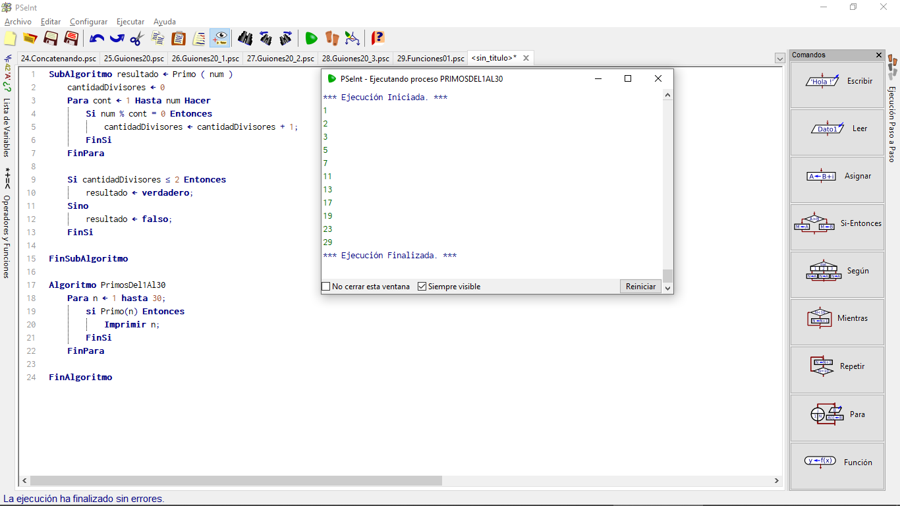

# Creación de Funciones y Procedimientos (Subprocesos)

En muchos casos, nos encontraremos con tareas que tenemos que repetir varias veces en distintos puntos de nuestro programa. Si tecleamos varias veces el mismo fragmento de programa no sólo tardaremos más en escribir: además el programa final resultará menos legible, será más también será más fácil que cometamos algún error alguna de las veces que volvemos a teclear el fragmento repetitivo, o que decidamos hacer una modificación y olvidemos hacerla en alguno de los fragmentos. Por eso, conviene evitar que nuestro programa contenga código repetitivo. Una de las formas de evitarlo es usar **SUBRUTINAS**, una posibilidad que la mayoría de lenguajes de programación permiten, y que en ocasiones recibe el nombre de **PROCEDIMIENTOS** o de **FUNCIONES** (existe algún matiz que hace que esas palabras no sean realmente sinónimas y que comentaremos más adelante).

PseInt permite definir **SUBRUTINAS** (o **FUNCIONES**) dentro del pseudocódigo, desde la versión del 10 de octubre de 2012. En su caso, se llaman **SUBPROCESOS**. Veamos un ejemplo de su uso:

Vamos a empezar por crear un **SUBPROCESO** (o **SUBRUTINA**, o **PROCEDIMIENTO**) que escriba 20 guiones, que podríamos utilizar para subrayar textos. Un programa completo que escribiera tres textos y los subrayara podría ser:

~~~pseudocode
Algoritmo Guiones20

    Escribir " Primer ejemplo";
    Para x <- 1 Hasta 20 Hacer
        Escribir Sin Saltar "-";
    FinPara
    Escribir "";

    Escribir " Segundo ejemplo";
    Para x <- 1 Hasta 20 Hacer
        Escribir Sin Saltar "-";
    FinPara
    Escribir "";

    Escribir " Tercer ejemplo";
    Para x <- 1 Hasta 20 Hacer
        Escribir Sin Saltar "-";
    FinPara
    Escribir "";

FinAlgoritmo
~~~

Veamoslo en Pseint:

Ejecutamos:

## Ejemplo Subproceso

Muy repetitivo. Sería un poco más elegante si lo reescribimos así:

~~~pseudocode
Algoritmo Guiones20_1

    Escribir " Primer ejemplo";
    Subrayar;

    Escribir " Segundo ejemplo";
    Subrayar;

    Escribir " Tercer ejemplo";
    Subrayar;
FinAlgoritmo

Subproceso Subrayar
    Para x <- 1 Hasta 20 Hacer
        Escribir Sin Saltar "-";
    FinPara
    Escribir "";    
FinSubproceso
~~~

Ahora veamoslo en PSeint:

Ejecutamos:

## Ejemplo Guiones

Mucho más legible, pero todavía no está tan bien como debería: siempre estamos escribiendo 20 guiones, aunque el texto sea más largo o más corto. En la mayoría de lenguajes de programación se puede indicar detalles adicionales (**PARÁMETROS**) para que se puedan utilizar desde dentro de esa **SUBRUTINA**. Por ejemplo, en nuestro caso podríamos indicarle qué texto queremos escribir y qué longitud queremos que tenga la secuencia de guiones:

~~~pseudocode
Algoritmo Guiones20_2

    EscribirSubrayado(" Primer ejemplo", 16);
    EscribirSubrayado(" Segundo ejemplo", 17);
    EscribirSubrayado(" Tercer ejemplo", 16);

FinAlgoritmo

Subproceso EscribirSubrayado(texto, cantidad)
    Escribir texto;
    Para x <- 1 Hasta cantidad Hacer
        Escribir Sin Saltar "-";
    FinPara
    Escribir "";

FinSubproceso
~~~

Escribimos el código en PSeint:

Ejecutamos:

## Uso de LONGITUD

Eso todavía es un poco redundante: en general, querremos escribir tantos guiones como letras tenga el texto, así que no será necesario indicar ese dato. Desde octubre de 2012, PseInt incluye ciertas funciones predefinidas para manejo de cadenas de texto; una de ellas es **LONGITUD**, que nos indica la cantidad de letras que tiene un texto, de modo que nuestro programa se podría simplificar así:

~~~pseudocode
Algoritmo Guiones20_3

    EscribirSubrayado("Primer ejemplo");
    EscribirSubrayado("Segundo ejemplo");
    EscribirSubrayado("Tercer ejemplo");
FinAlgoritmo

Subproceso EscribirSubrayado(texto)
    Escribir texto;
    Para x <- 1 Hasta Longitud(texto) Hacer
        Escribir Sin Saltar "-";
    FinPara
    Escribir "";

FinSubproceso
~~~

Coloquemos el código en PSeint:

Ejecutamos:

## Subprocesos con Operaciones

También podemos crear subprocesos que realicen ciertas operaciones aritméticas y devuelvan un resultado, como las funciones matemáticas que vimos en el tema 10. Se puede hacer con la misma palabra **SUBPROCESO** que hemos empleado hasta ahora, pero muchos lenguajes de programación distinguen entre un "**PROCEDIMIENTO** o **SUBRUTINA**, cuando se da una serie de pasos pero no se devuelve ningún valor (como habíamos hecho hasta ahora), y una **FUNCIÓN**, cuando sí se devuelve un resultado (como haremos en esta ocasión), así que usaremos esta última nomenclatura. Su desarrollo se parece mucho a lo que hemos hecho hasta ahora, con la diferencia de que escogeremos un nombre para la variable que guardará el resultado, así:

~~~pseudocode
Funcion resultado <- Maximo( n1, n2)

    Si n1 > n2  Entonces
        resultado <- n1;
    Sino
        resultado <- n2;
    FinSi
FinFuncion

Algoritmo Funciones01

    Escribir "El máximo de 5 y 12 es:";
    Escribir Maximo(5,12);
    Escribir "El máximo de 25 y 12 es:";
    Escribir Maximo(25,12);

FinAlgoritmo
~~~

Colocamos el código en PSeint:

Ejecutamos:

Este programa crea una función que calcula cuál es el mayor de los dos números que se le indican como parámetro, y la usa dos veces, para mostrar el máximo de dos valores prefijados.

## Subprocesos Cadenas

No sólo podemos devolver valores numéricos; también podemos devolver cadenas (como las funciones que vimos en el apartado 13) o "valores de verdad" (verdadero, falso). Por ejemplo, podemos crear una función que calcule si un número es primo o no (lo vamos a hacer de la forma más simple pero también de la menos eficiente: aplicar la definición, probando a dividir entre todos los números que hay entre 1 y n; si hemos encontrado dos divisores -o menos, para el número uno-, entonces el número es primo):

~~~pseudocode
SubAlgoritmo resultado <- Primo ( num )
    cantidadDivisores <- 0
    Para cont <- 1 Hasta num Hacer
        Si num % cont = 0 Entonces
            cantidadDivisores <- cantidadDivisores + 1;
        FinSi
    FinPara

    Si cantidadDivisores <= 2 Entonces
        resultado <- verdadero;
    Sino
        resultado <- falso;
    FinSi

FinSubAlgoritmo

Algoritmo PrimosDel1Al30
    Para n <- 1 hasta 30;
        si Primo(n) Entonces
            Imprimir n;
        FinSi
    FinPara

FinAlgoritmo
~~~

Colocamos en PSeint:

Ejecutamos:

¡Excelente! Terminaste los fundamentos del pseudocódigo.

¿Díficil?
