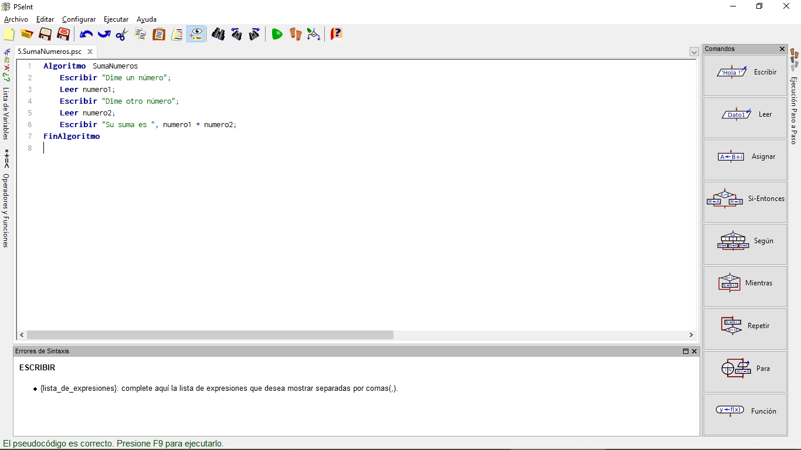
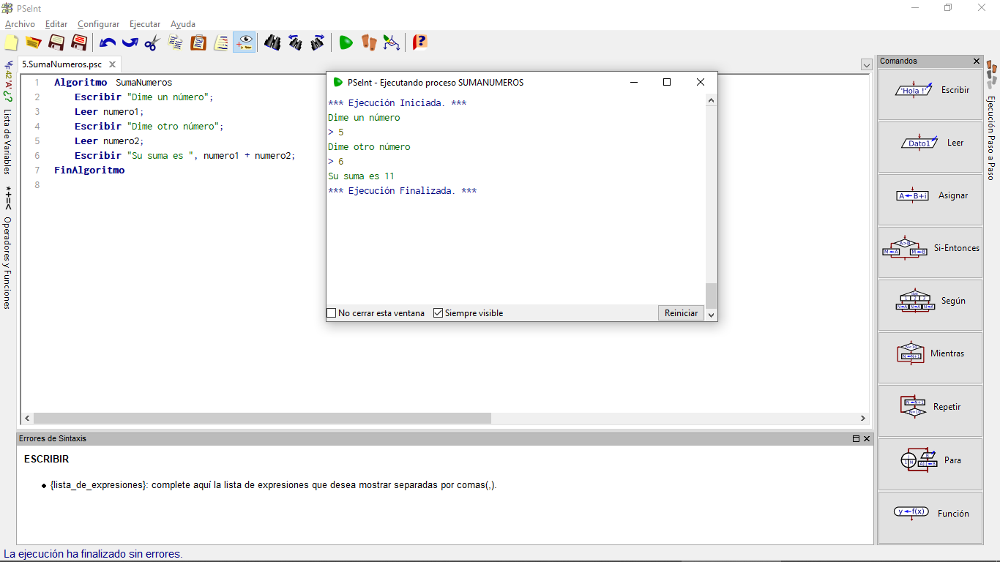
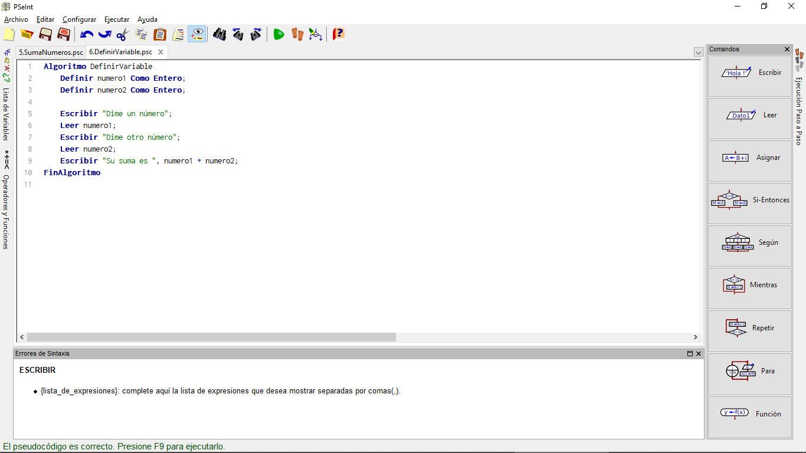
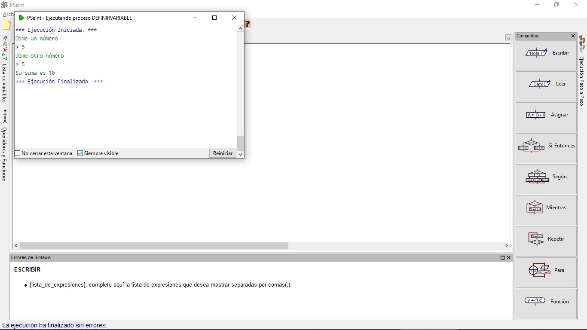
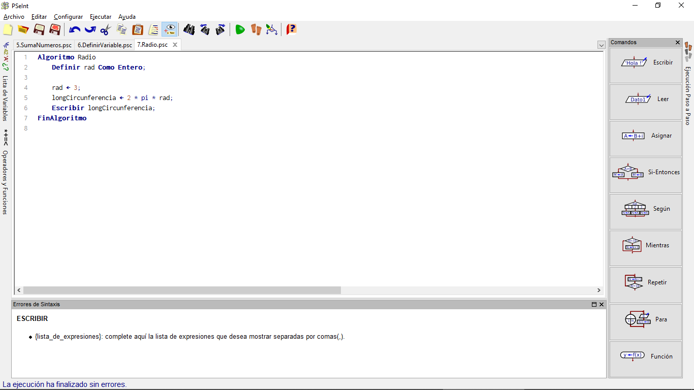
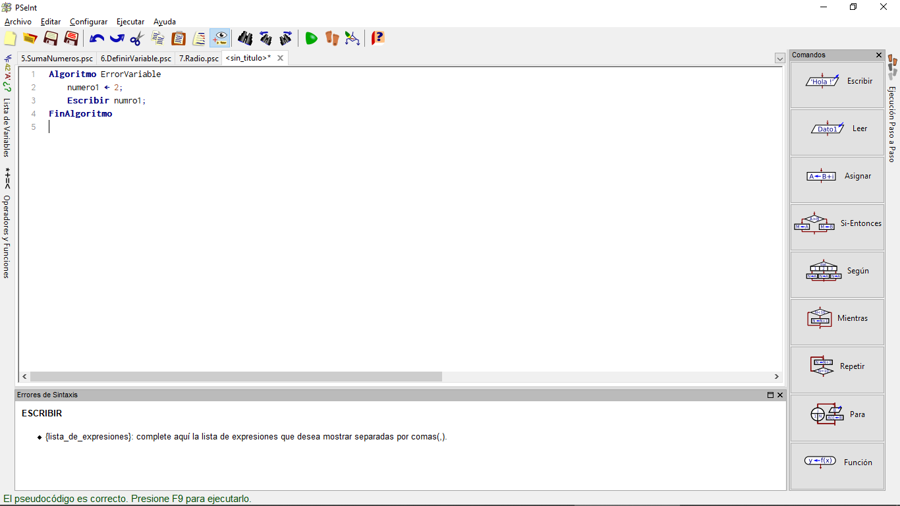

# Variables

Ahora aprenderemos a defnir las variables, estás pueden ser definidas previamente, o bien ser un dato que ingrese el usuario a través de su hardware.

Para lograr esto utilizaremos la orden **LEER**, esta orden nos permite obtener un dato que el usuario ingrese y dejarlo guardado para utilizarlo después, esto a través de un nombre temporal para cada dato recopilado.

A este caso asignaremos el nombre de *numero1* y *numero2*.

La función que realizará el programa será obtener la suma de los dos número que ingresa el usuario.

El programa debería quedar así:

~~~pseudocode
Algoritmo SumaNumeros
    Escribir "Dime un número"
    Leer numero1
    Escribir "Dime otro número"
    Leer numero2
    Escribir "Su suma es ", numero1 + numero2
FinalAlgoritmo
~~~

Ahora, una vez escrito nuestro programa en PSeint, pasamos a probar si funciona:

## Definir Variables

Las palabras *numero1* y *numero2* representan números que no tienen valor prefijado. Eso es lo que se le conoce como "variables". Por lo general en la mayoría de lenguajes de programación las variables deben declararse antes de usarse, por lo que tomando nuestro ejemplo anterior, nuestro código sería el siguiente:

~~~pseudocode
Algoritmo DefinirVariable
    Definir numero1 Como Entero;
    Definir numero2 Como Entero;

    Escribir "Dime un número";
    Leer numero1;
    Escribir "Dime otro número;
    Leer numero2;
    Escribir "Su suma es ", numero1 + numero2;
FinAlgoritmo
~~~

Tu pseudocódigo debe verse de la siguiente forma:

Una vez que esta listo tu programa, solo queda correrlo, debe darte un resultado parecido al siguiente:

Estas variables se deben definir para indicarle al procesador que cantidad de memoria reservar para ese tipo de dato a almacenar.

## Definir Valor de Variables

No siempre se requiere que el valor de una variable lo de el usuario, habrá ocasiones donde ya deberá ir establecido, en el pseudocódigo, la forma de establecer estos valores es con la siguiente secuencia de símbolos "<-".
Por ejemplo:

~~~pseudocode
rad <- 3;
longCircunferencia <- 2 * pi * rad;
~~~

Esos símbolos representan una flecha indicando que ese valor se va a guardar dentro del espacio de memoria para la variable llamada *rad*.

Ahora veamos esto en nuestro editor:

Una vez hecho esto, pasamos a probar que funcione el código:

## Error en las Variables o Sin Valor

Si por error se llega a escribir mal una variable, pasaría a no estar definida, por consecuencia, no tendría valor.
Algunos lenguajes generan una variable nueva y devuelven el valor "0".
Sin embargo, este no es el caso del pseudocódigo, pues no devuelve nada.

Observemos un ejemplo del código a usar:

~~~pseudocode
numero1 <- 2
Escribir numro1
~~~

Como podrás notar en *numero1* hemos definido de manera incorrecta la variable:

Ahora, observa que al correr este código, no devuelve ningún valor PSeint:

¡Excelente! Acabas de completar otra lección.

No olvides revisar los ejercicios.
