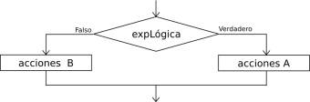
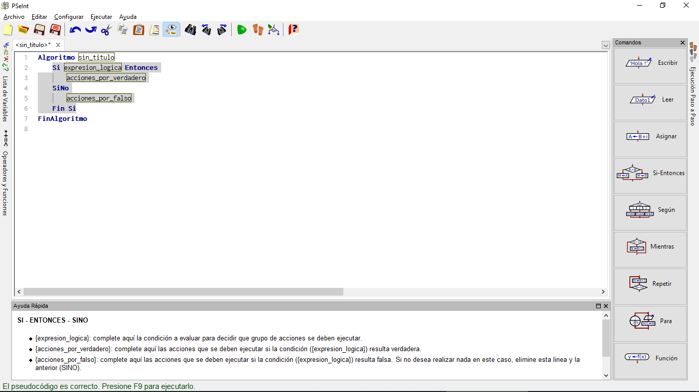
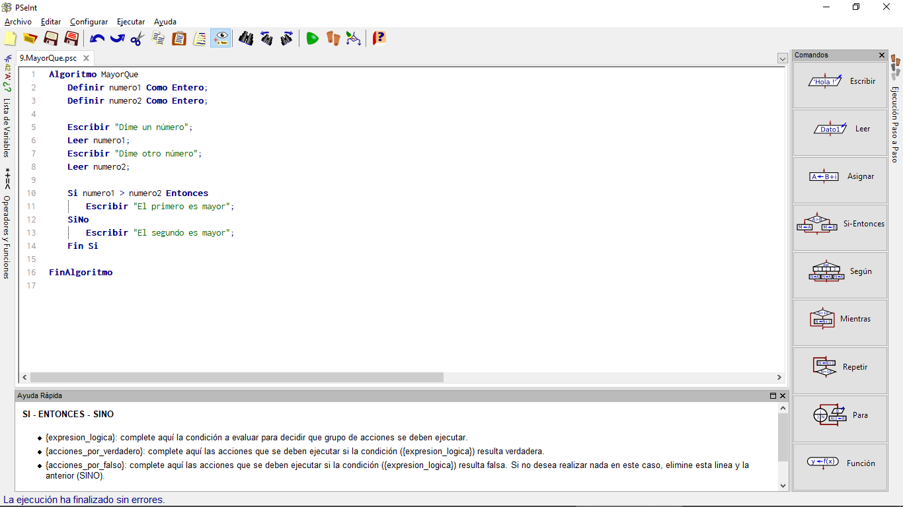
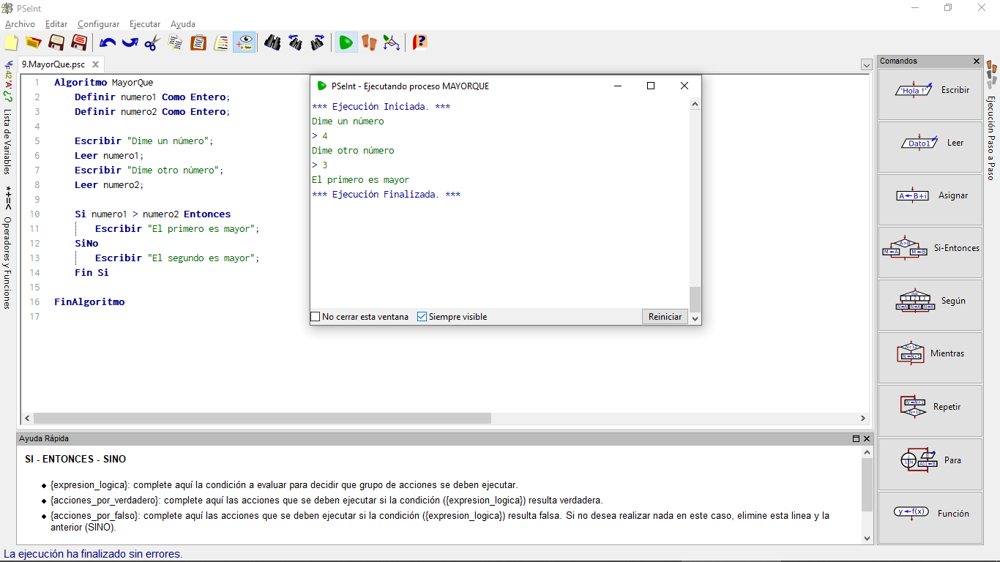

# Comprobando Condiciones (1. Si)

En cualquier secuencia de indicaciones de informática es vital en ocasiones comprobar si se cumple alguna condición. Una de las primeras formas para hacerlo es con **SI**.

Su estructura básica sería:

~~~pseudocode
Si condición Entonces
    pasos_a_dar_si_es_verdadero
SiNo
    pasos_a_dar_si_es_falso
FinSi
~~~

El bloque "SiNo" es opcional, puedes optar por no ponerlo.

## Diagrama de Flujo en el Si

Para ayudarnos a planificar el comportamiento de una secuencia de instrucciones, se suele usar como ayuda los llamados "diagramas de flujo". En estos diagramas, una condición se representa como un rombo, del que salen dos flechas: una para la secuencia de acciones a realizar si se cumple la condición y otra para cuando no se cumple:

Así, si en PSeInt hacemos clic en el icono de la parte derecha que representa la condición SI-ENTONCES, aparece un esqueleto de programa casi completo, para que hagamos los cambios que nos interesen:

Sólo tenemos que escribir la condición que realmente nos interesa, y la serie de pasos que se deben dar si se cumple y si no se cumple, de modo que nuestro programa podría quedar así:

~~~pseudocode
Algoritmo MayorQue

  Escribir "Dime un numero";
  Leer numero1;
  Escribir "Dime otro numero";
  Leer numero2;

  Si numero1 > numero2 Entonces
    Escribir "El primero es mayor";
  Sino
    Escribir "El segundo es mayor";
  FinSi
  
FinAlgoritmo
~~~

Así debió quedar el código en PSeint:

Ahora ejecutemos el código:

En ese ejemplo comparamos si un valor es mayor que otro. Los operadores de comparación que están disponibles son:

1. < Menor que
2. \> Mayor que
3. = Igual que
4. <= Menor o igual que
5. \>= Mayor o igual que
6. <> Distinto de

Tambien puedes comprobar varias condiciones a la vez, para hacer instrucciones más complejas.
Los operadores lógicos que puedes usar son:

1. & ó Y (Conjunción)
    Ejemplo: (7>4) & (2=1)// Falso

2. | ó O (Disyunción)
    Ejemplo: (1=1 | 2=1)// Verdadero

3. ~ ó NO(Negación)
    Ejemplo: ~(2<5) //Falso

