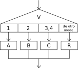
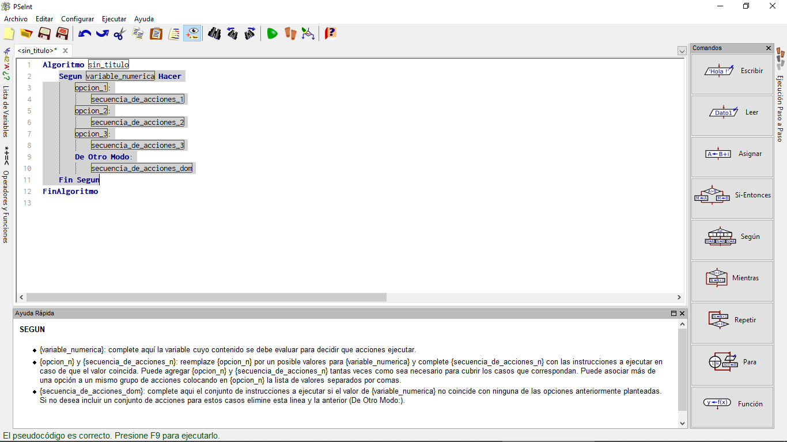
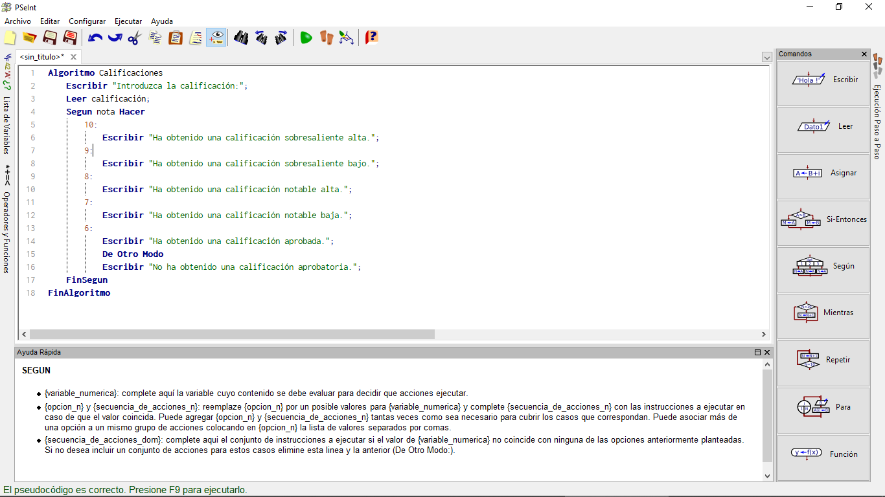
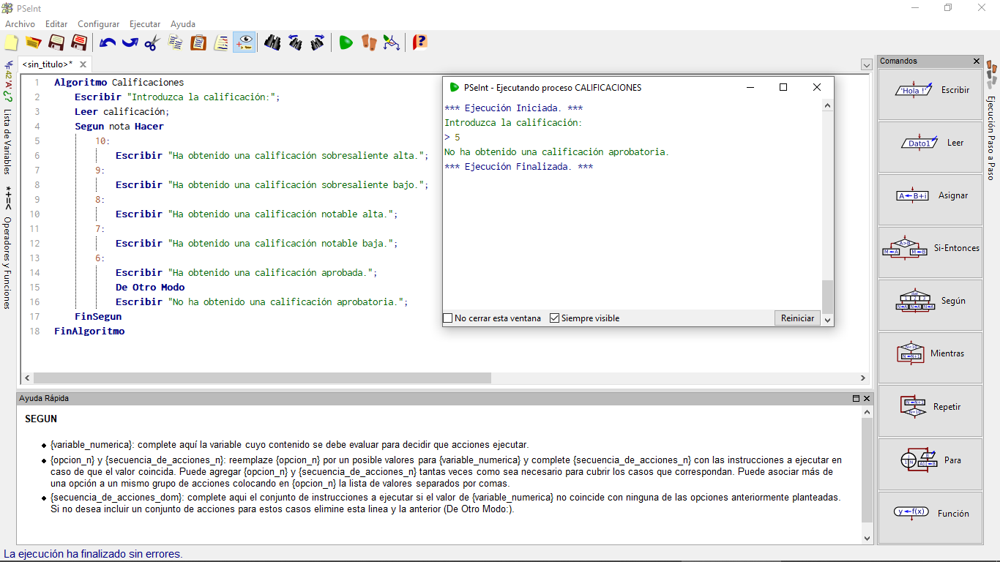

# Comprobando Condiciones (2. Según)

Es frecuente tener que comprobar más de una condición a la vez, o bien varias condiciones consecutivas. En concreto, un caso especialmente habitual es el de que una variable pueda tomar un valor de entre varios. Por ejemplo, en el sistema de notas escolares español clásico, ciertas notas numéricas tienen "nombres" asociados: un 5 es un aprobado, un 9 y un 10 son sobresaliente, etc. Si queremos hacer un programa que convierta de la nota numérica a su equivalente escrito, podríamos emplear varias órdenes "SI", una tras la otra. Pero en muchos lenguajes de programación (y por tanto, también en muchas variantes de pseudocódigo) existe una alternativa más compacta y más legible: la orden **SEGUN**. Esta orden permite hacer unas cosas u otras según el valor que tome una variable. Su uso sería así:

~~~pseudocode
Segun variable Hacer
    valor1: pasos_a_seguir_si_el_valor1;
    valor2: pasos_a_seguir_si_el_valor2;
    valor3: pasos_a_seguir_si_el_valor3;
De Otro Modo:
    pasos_a_seguir_si_es_otro_valor
FinSegun
~~~

El bloque "De Otro Modo" es opcional: si detallamos todos los valores posibles, no sería necesario utilizarlo.

El número de valores que podemos probar es indefinido: no tiene por qué ser 3, sino que pueden ser menos casos o muchos más.

Según la variante de pseudocódigo (o el lenguaje de programación) que empleemos, puede haber restricciones en el tipo de datos que es aceptable. Por ejemplo, en el caso de PseInt, la variable tiene que tener un valor numérico, no puede ser un texto.

Al igual que ocurría con la orden SI, existe un símbolo que podemos usar en los diagramas de flujo para ayudarmos a planificar nuestro programa (aunque este símbolo está menos extendido que el de SI):

## SEGUN en PSeint

Si en PseInt hacemos clic en el icono del panel derecho que representa la condición SEGUN, aparece un esqueleto de programa casi completo, para que hagamos los cambios que nos interesen:

## Resolviendo las Calificaciones

Sólo tenemos que escribir la condición que realmente nos interesa, y la serie de pasos a dar si se cumple y si no se cumple, de modo que nuestro programa tomando en cuenta el ejemplo mencionado de las calificaciones podría quedar así:

~~~pseudocode
Algoritmo Calificaciones
    Escribir "Introduzca la calificación:";
    Leer calificación;
    Segun nota Hacer
        10:
            Escribir "Ha obtenido una calificación sobresaliente alta.";
        9:
            Escribir "Ha obtenido una calificación sobresaliente bajo.";
        8:
            Escribir "Ha obtenido una calificación notable alta.";
        7:
            Escribir "Ha obtenido una calificación notable baja.";
        6:
            Escribir "Ha obtenido una calificación aprobada.";
       De Otro Modo
            Escribir "No ha obtenido una calificación aprobatoria.";
    FinSegun
FinAlgoritmo
~~~

En tu PSeint el código se vería de la siguiente forma:

Una vez escrito tu programa, solo ejecutalo.

## Usos Adicionales del SEGUN

Pero no siempre habrá que comprobar condiciones una única vez. Es muy frecuente que haya que hacerlo de forma repetitiva. Por ejemplo, "pedir una contraseña al usuario hasta que sea la correcta", o aún más cercano al mundo real, "pedir una contraseña al usuario hasta que sea la correcta o agote sus intentos".
