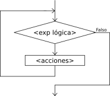
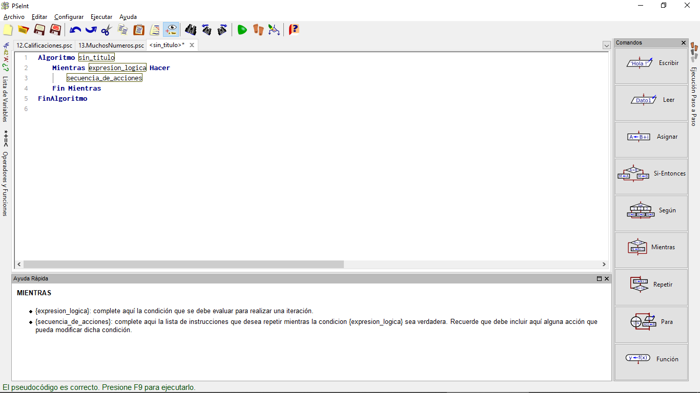
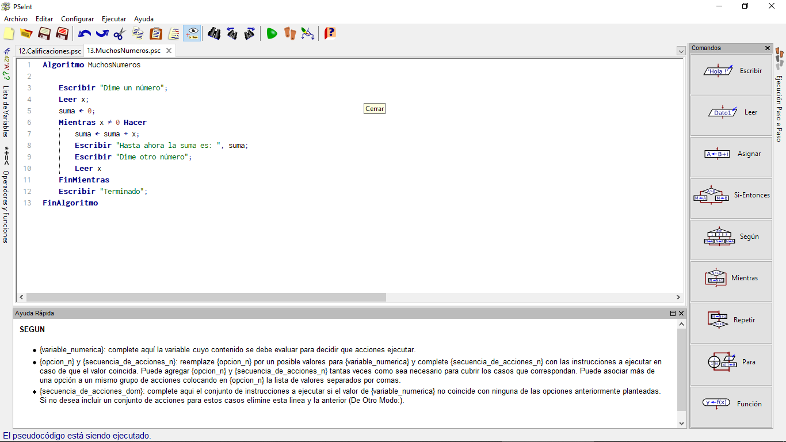
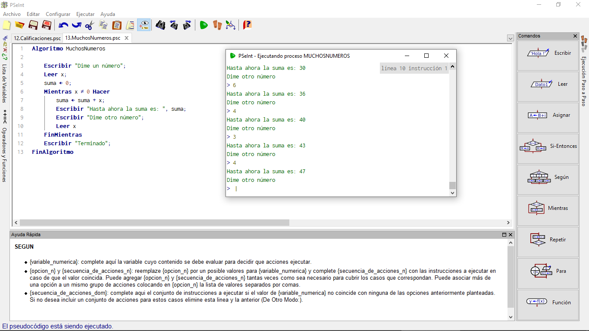

# Condiciones Repetitivas (1.Mientras)

Habitualmente, una condición se deberá comprobar más de una vez. Por ejemplo, una condición de error puede repetirse: el usuario que introduce mal una contraseña por primera vez puede equivocarse también en una segunda ocasión.

Por eso, igual que cualquier lenguaje de programación tiene una orden "si", la gran mayoría de ellos tendrá una orden **MIENTRAS**, que permite que un fragmento de un programa se repita mientras una cierta condición se siga cumpliendo (por ejemplo, mientras la contraseña que teclee el usuario sea incorrecta, el usuario deberá volver a introducirla).

También existe un símbolo habitual en los diagramas de flujo para representar este tipo de condiciones repetitivas, en las que si se cumple la condición, se realiza una serie de acciones y se vuelve a comprobar la condición, y así sucesivamente hasta que la condición no se cumpla:

## MIENTRAS en PSeint

Y en el caso de PseInt, ese icono generaría un esqueleto de programa como éste:

## Ejemplo SumasNumeros

Un programa capaz de sumar muchos números, todos los que el usuario quisiera, y en el que hubiera que escribir "0" para indicar que queremos terminar, podría ser así:

~~~pseudocode
Algoritmo MuchosNumeros

    Escribir "Dime un número";
    Leer x;
    suma <- 0; 
    Mientras x <> 0 Hacer
        suma <- suma + x;
        Escribir "Hasta ahora la suma es: ", suma;
        Escribir "Dime otro número";
        Leer x
    FinMientras
    Escribir "Terminado";
FinAlgoritmo
~~~

En nuestro Pseint, debería de verse así:

Tras jugar un rato con el debería de verse así tu resultado:

Esta estructuras repetitivas reciben también el nombre de **bucles**.
