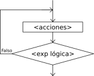
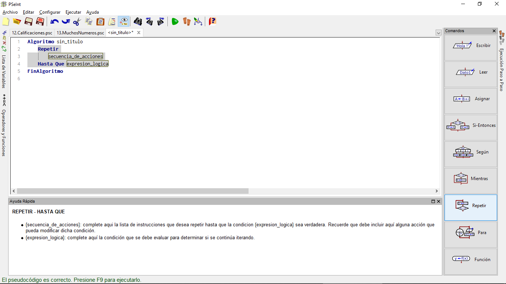
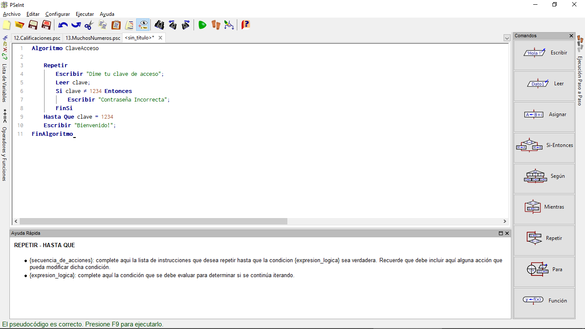
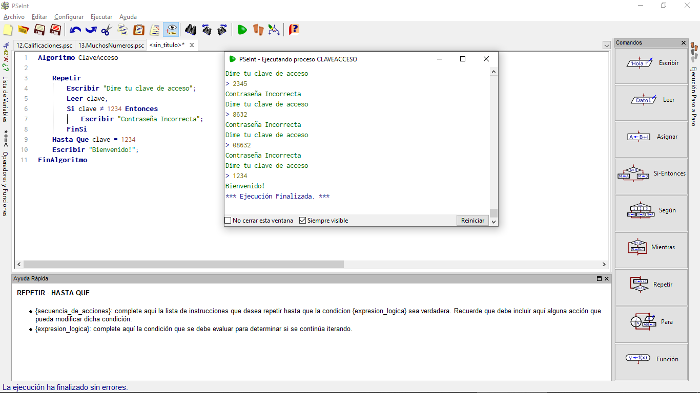

# Condiciones Repetitivas (2. REPETIR HASTA)

Es también muy frecuente que un bloque de programa repetitivo deba ejecutarse al menos una vez. Por ejemplo, si queremos pedir un dato al usuario, quizá exista algún error y haya que insistir, pero al menos deberemos pedírselo una primera vez.

En estos casos, la estructura **MIENTRAS** no es la más adecuada, porque no podemos comprobar antes de pedir el valor. En estos casos (que son muy frecuentes), sería más razonable usar otra estructura de programación en la que la condición se compruebe después de dar ciertos pasos. Esa estructura es **REPETIR... HASTA**:

Su representación en un diagrama de flujo sería:

## REPETIR HASTA en PSeint

En el caso de PSeInt, ese icono generaría un esqueleto de programa como éste:

## Ejemplo ClaveAcceso

Un programa que pida al usuario una clave de acceso, y que no le permita seguir hasta que la introduzca correctamente, se podría hacer así:

~~~pseudocode
Algoritmo ClaveAcceso

    Repetir
        Escribir "Dime tu clave de acceso";
        Leer clave;
        Si clave <> 1234 Entonces
            Escribir "Contraseña Incorrecta";
        FinSi
    Hasta Que clave = 1234
    Escribir "Bienvenido!";
FinAlgoritmo
~~~

En nuestro PSeint debería quedar así:

Al ejecutar el código debería ocurrir esto:

