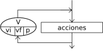
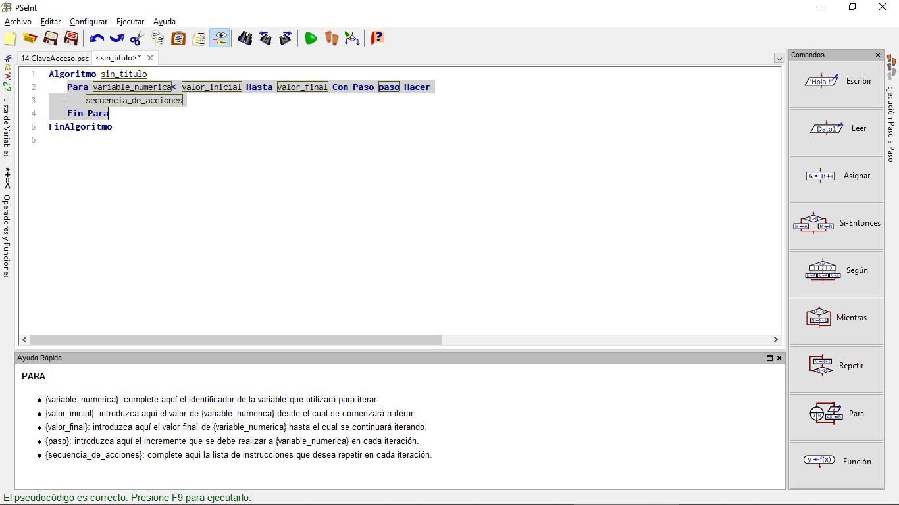
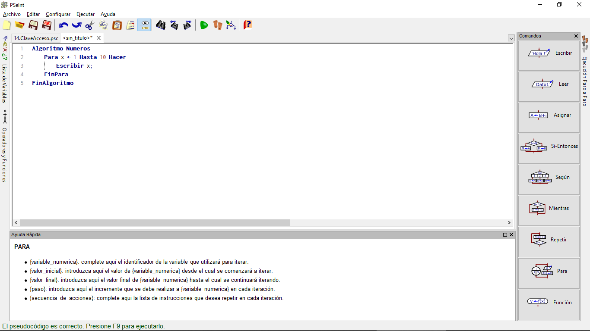
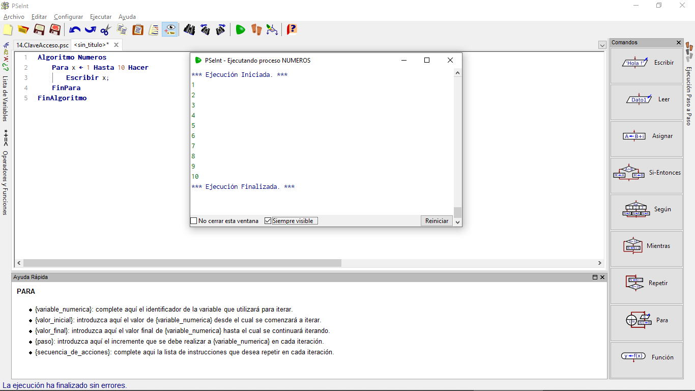
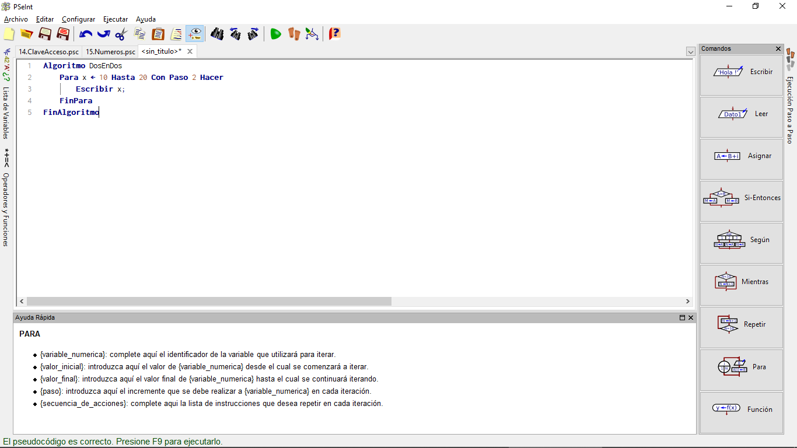
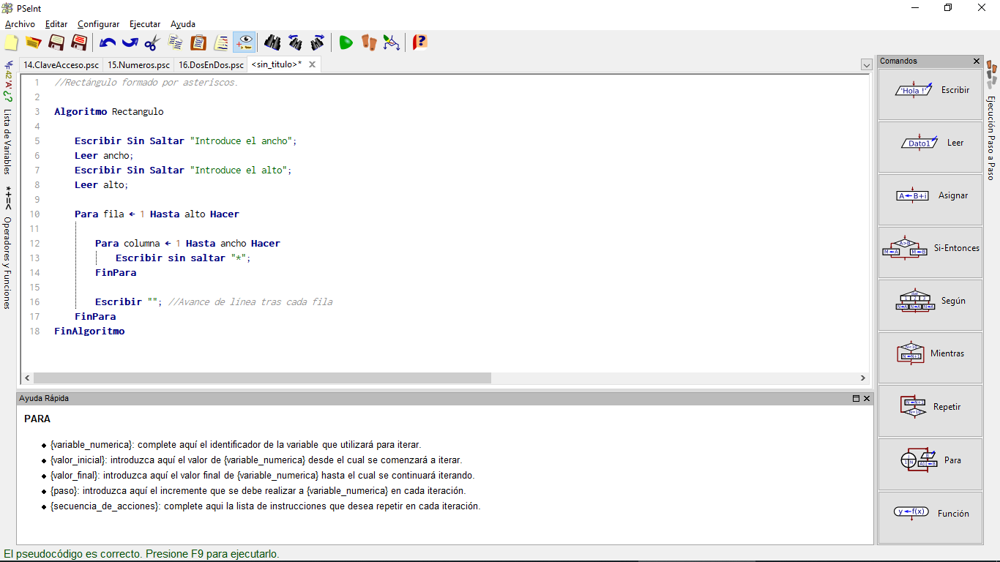

# Repetir Un Cierto Número de Veces: Para

En muchas ocasiones, no queremos que algo se repita mientras se cumpla una condición, sino un cierto número de veces. Por ejemplo, para escribir "Hola" 3 veces en pantalla existe una orden más cómoda que la orden **MIENTRAS** o la orden **REPETIR... HASTA**. Es la orden **PARA**, que hace que una variable tome una serie de valores que se van incrementando. Por ejemplo, una estructura "**PARA** x con valores desde 2 hasta 4" haría que un bloque de programa se repitiera 3 veces. En la primera repetición, la variable "x" tendría el valor 2, en la segunda tendría el valor 3 y en la tercera tendría el valor 4. La sintaxis exacta en PSeInt es:

~~~pseudocode
Para variable <- valorInicial Hasta valorFinal Hacer
~~~

Su representación en un diagrama de flujo es:

## PARA en PSeint

En el caso de PSeInt, ese icono generaría un esqueleto de programa como éste:

## Ejemplo Numeros

Un programa que mostrará los números del 1 al 10 podría ser:

~~~pseudocode
Algoritmo Numeros
    Para x <- 1 Hasta 10 Hacer
        Escribir x;
    FinPara
FinAlgoritmo
~~~

El código en PSeint:

Esto nos da como resultado:

## PASO

Si no queremos avanzar de uno en uno, sino con un incremento distinto, podemos indicar otro tamaño de **PASO**:

~~~pseudocode
Algoritmo DosEnDos
    Para x <- 10 Hasta 20 Con Paso 2 Hacer
        Escribir x;
    FinPara
FinAlgoritmo
~~~

El código debería verse de la siguiente manera:

Después de ejecutarlo deberías obtener un resultado así:

Hemos visto casi todas las construcciones que podremos encontrar en los lenguajes de programación convencionales (y, por tanto, al planificarlos usando pseudocódigo).

## Bucle Anidado

Las estructuras repetitivas ("bucles") se pueden incluir una dentro de otra si fuera necesario. El resultado se conoce como un "bucle anidado". Por ejemplo, si se desea dibujar un rectángulo usando asteriscos, se puede plantear como escribir de forma repetitiva varias filas que, a su vez están formadas cada una por varias columnas, de forma también repetitiva, como muestra este ejemplo:

~~~pseudocode

//Rectángulo formado por asteriscos.

Algoritmo Rectangulo

    Escribir Sin Saltar "Introduce el ancho";
    Leer ancho;
    Escribir Sin Saltar "Introduce el alto";
    Leer alto;

    Para fila <- 1 Hasta alto Hacer

        Para columna 1 <- Hasta ancho Hacer
            Escribir sin saltar "*";
        FinPara

        Escribir ""; //Avance de línea tras cada fila
    FinPara
FinAlgoritmo
~~~

En nuestro PSeint debería verse así:

Ahora ejecutamos el código:

¡Excelente! Completaste otra lección.
