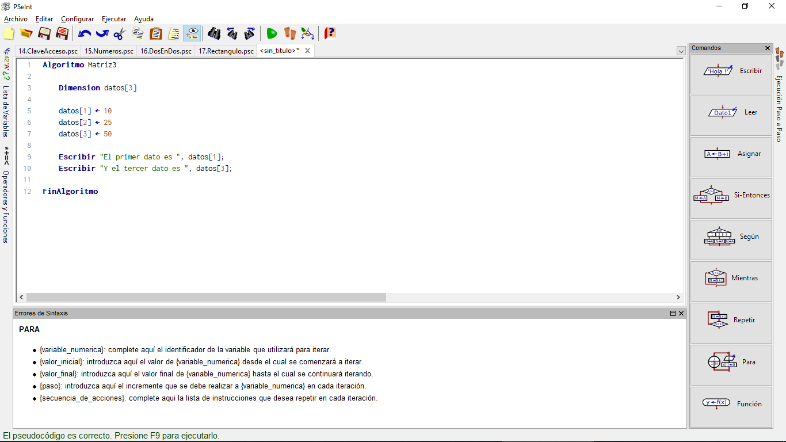
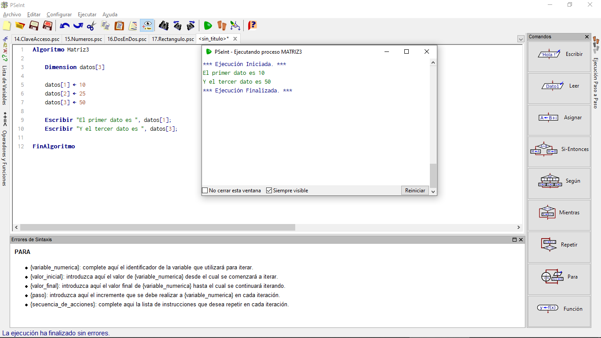
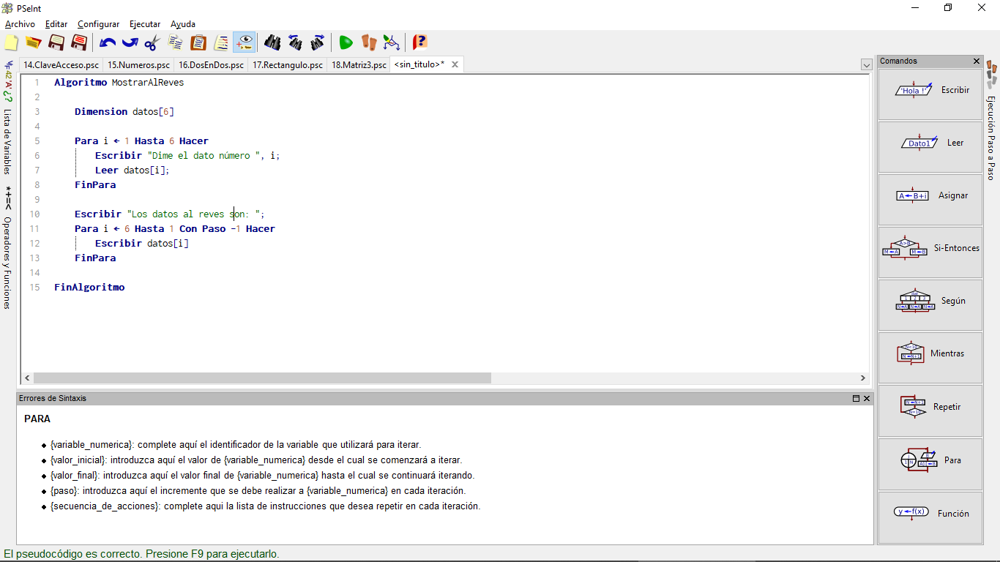
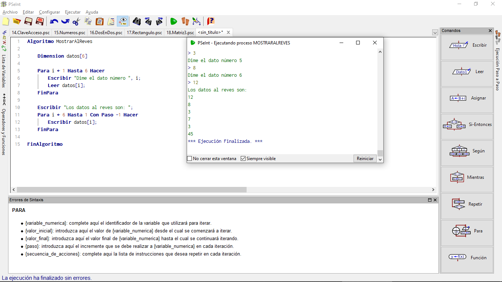
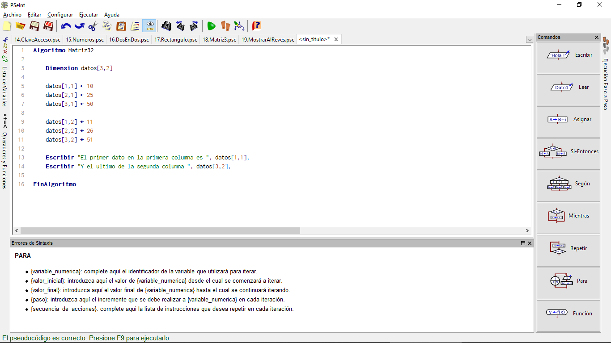
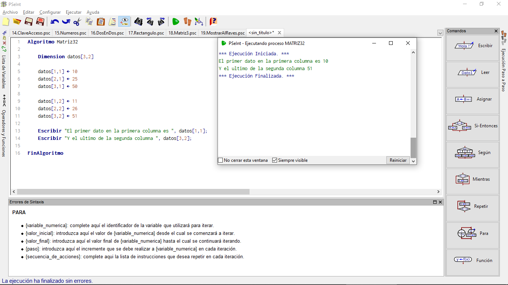

# Matrices

Cuando necesitamos manejar muchos datos, generalmente hay soluciones más efectivas que tener muchas variables. Por ejemplo, si hay que guardar 10 números, resultará incómodo usar 10 variables llamadas n1, n2, n3, n4, n5, n6, n7, n8, n9, n10; si se trata de 100 números, puede pasar de resultar incómodo a ser totalmente inviable. En esos casos, será más eficiente almacenar esos 100 datos "juntos", formando lo que se conoce como una "matriz", en vez de usar 100 variables distintas.

La palabra "matriz" es una traducción del inglés "array". Algunos autores lo traducen alternativamente como tabla, vector o incluso "arreglo".

Normalmente, en una matriz podremos acceder individualmente a cada uno de sus elementos usando corchetes: el primer dato sería algo como "dato[1]".

## Ejemplo Matriz3

Como primer contacto, se puede crear una matriz de 3 elementos, guardar datos en sus 3 posiciones y mostrar el primer dato y el tercero así:

~~~pseudocode
Algoritmo Matriz3

    Dimension datos[3]

    datos[1] <- 10
    datos[2] <- 25
    datos[3] <- 50

    Escribir "El primer dato es ", datos[1];
    Escribir "Y el tercer dato es ", datos[3];

FinAlgoritmo
~~~

Esta matriz en nuestro PSeint se vería así:

¿Sabes qué pasa al ejecutarlo? Veamos

## Ejemplo MostrarAlReves

Como una matriz puede contener muchos datos, es frecuente recorrerlas de forma repetitiva, empleando una orden **PARA**. Así un ejemplo que nos pida 6 datos y luego los muestre en orden contrario al que se han introducido podría ser:

~~~pseudocode
Algoritmo MostrarAlReves

    Dimension datos[6]

    Para i <- 1 Hasta 6 Hacer
        Escribir "Dime el dato número ", i;
        Leer datos[i];
    FinPara

    Escribir "Los datos al reves son: ";
    Para i <- 6 Hasta 1 Con Paso -1 Hacer
        Escribir datos[i]
    FinPara

FinAlgoritmo
~~~

En PSeint queda así:

Ahora ejecutemos el código para ver cual es el resultado

## Arrays de "Dos Dimensiones"

También se pueden crear arrays "de dos dimensiones" (por ejemplo, 3 filas y dos columnas), que se acercan más al concepto matemático de matriz:

~~~pseudocode
Algoritmo Matriz32
 
 Dimension datos[3,2]

    datos[1,1] <- 10
    datos[2,1] <- 25
    datos[3,1] <- 50

    datos[1,2] <- 11
    datos[2,2] <- 26
    datos[3,2] <- 51

    Escribir "El primer dato en la primera columna es ", datos[1,1]
    Escribir "Y el ultimo de la segunda columna ", datos[3,2]
FinAlgoritmo
~~~

El programa en PSeint debe verse así:

Y al ejecutarse debe mostrarte algo así:

¡Genial! Acabaste otra lección.
