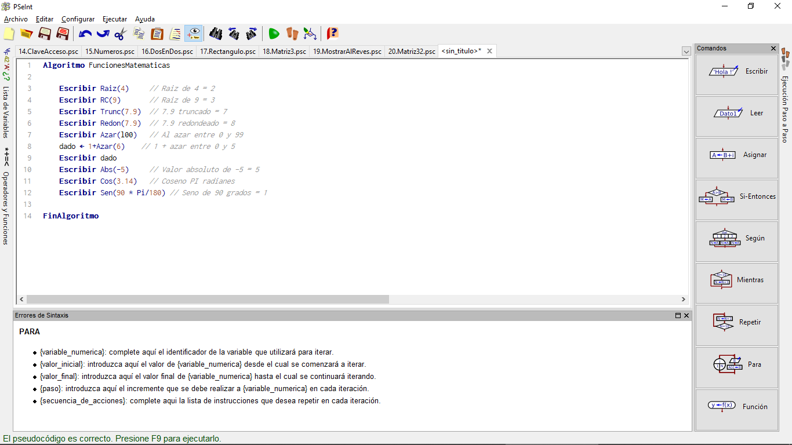
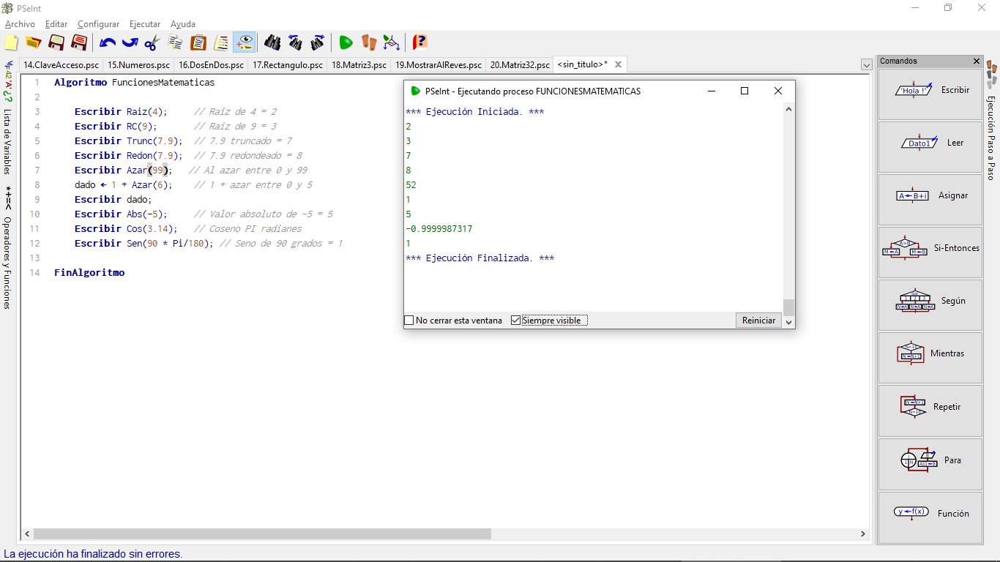

# Funciones Matemáticas

Casi cualquier lenguaje de programación tiene incorporadas ciertas funciones matemáticas, de modo que nos permita calcular raíces cuadradas, logaritmos, senos y cosenos, etc.

Lo mismo ocurre en muchas variantes de pseudocódigo. Por ejemplo, PseInt incluye las siguientes funciones matemáticas:

1. RC(X) ó RAIZ(X): Raíz cuadrada de x

2. ABS(X): Valor absoluto de x

3. LN(X): Logaritmo natural de x

4. EXP(X): Función exponencial de x

5. SEN(X): Seno de un ángulo x, medido en radianes

6. COS(X): Coseno de un ángulo x, medido en radianes

7. TAN(X): Tangente de un ángulo x, medido en radianes

8. ASEN(X): Arco seno de x

9. ACOS(X): Arco coseno de x

10. ATAN(X): Arco tangente de x

11. TRUNC(X): Parte entera de x

12. REDON(X): Entero más cercano a x

13. AZAR(X): Entero aleatorio entre 0 y x-1

Si no sabes qué hace alguna de estas funciones, no te preocupes mucho, es señal de que hasta ahora no la has necesitado... ;-) Vamos a ver un ejemplo de algunas de ellas, y luego practicaremos las más importantes como parte de los ejercicios.

## Funciones Matemáticas en código

Ahora, escribir las funciones matemáticas en programación es super sencillo, casi todos los lenguajes tienen las mismas bases, así que ojo en como se ve en este fragmento:

~~~pseudocode
Algoritmo FuncionesMatematicas 
    Escribir Raiz(4)     // Raiz de 4 = 2 
    Escribir RC(9)       // Raiz de 9 = 3 
    Escribir Trunc(7.9)  // 7.9 truncado = 7 
    Escribir Redon(7.9)  // 7.9 redondeado = 8 
    Escribir Azar(99)   // Al azar entre 0 y 99 
    dado <- 1+Azar(6)    // 1 + azar entre 0 y 5 
    Escribir dado 
    Escribir Abs(-5)     // Valor absoluto de -5 = 5 
    Escribir Cos(3.14)   // Coseno PI radianes 
    Escribir Sen(90 * Pi/180) // Seno de 90 grados = 1 
FinAlgoritmo 
~~~

Ponemos este fragmento en nuestro PSeint:

Y ejecutamos...

Ahora no te preocupes, en los ejercicios puedes ver más a detalle cada función.
